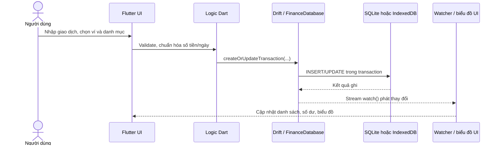
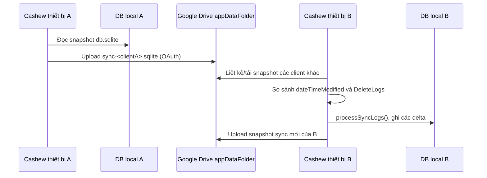

# Báo cáo phân tích kiến trúc hệ thống Cashew

## 1. Phạm vi và kết luận chính

Phân tích này dựa trên mã nguồn hiện có trong thư mục `budget/`, không dựa vào giả định về hạ tầng bên ngoài. Cashew là ứng dụng quản lý chi tiêu viết bằng **Flutter/Dart**, triển khai được trên Android, iOS và Web/PWA. Kiến trúc thực tế là **local-first, client-centric**: phần lớn nghiệp vụ, truy vấn, tổng hợp và dữ liệu tài chính chạy trên thiết bị/trình duyệt của người dùng.

Không có backend tự phát triển, máy chủ API, API Gateway, hàng đợi, cache server hay cơ sở dữ liệu trung tâm cho toàn bộ giao dịch. Khi người dùng bật các chức năng đám mây, ứng dụng gọi trực tiếp SDK/API của Firebase, Google Sign-In và Google Drive. Do đó, sơ đồ dưới đây phân biệt rõ luồng cốt lõi cục bộ với các tích hợp tùy chọn.

| Thuộc tính | Hiện trạng |
|---|---|
| Kiểu kiến trúc | Monolithic client Flutter, local-first |
| Frontend | Flutter Material UI; web được đóng gói thành PWA |
| Lớp nghiệp vụ/dữ liệu | Dart trong cùng ứng dụng; `FinanceDatabase`/Drift là repository/data-access layer |
| Lưu trữ chính | SQLite trên native; IndexedDB (hoặc `localStorage` fallback) trên web |
| Dịch vụ đám mây | Firebase Authentication, Cloud Firestore cho ngân sách chia sẻ; Google Drive `appDataFolder` cho backup/sync |
| API Gateway/backend riêng | Không có trong repository |

## 2. Sơ đồ kiến trúc tổng thể

```mermaid
flowchart TB
  U[Người dùng] --> UI[Flutter UI\nPages • Widgets • Provider/ChangeNotifier]
  UI --> B[Logic nghiệp vụ Dart\nvalidation • CRUD • thống kê • thông báo]
  B --> R[Data access: Drift\nFinanceDatabase]
  R --> N[(Native: db.sqlite\nApplication Documents)]
  R --> W[(Web: IndexedDB\nlocalStorage fallback)]
  B --> P[SharedPreferences\nthiết lập & trạng thái nhẹ]

  UI -. đăng nhập tùy chọn .-> A[Google Sign-In]
  A --> FA[Firebase Authentication]
  B -. ngân sách chia sẻ .-> FS[Cloud Firestore\n/budgets/{id}\n/transactions/{id}]
  B -. backup & đồng bộ tùy chọn .-> GD[Google Drive API\nappDataFolder]
  GD --> BK[(Bản sao .sqlite)]

  B --> OS[Thiết bị/OS\nthông báo • sinh trắc học\nwidget • file picker]
```

Điểm quan trọng: các mũi tên nét đứt là tùy chọn và không nằm trên đường ghi giao dịch cá nhân thông thường. Một giao dịch vẫn được tạo/đọc khi offline vì được ghi vào database cục bộ trước.

## 3. Phân tích các thành phần CNTT

| Thành phần | Công nghệ và trách nhiệm | Nhận xét kiến trúc |
|---|---|---|
| Giao diện người dùng | Flutter, Material UI, các `pages/`, `widgets/`, `Provider`/`ChangeNotifier` | Một codebase đa nền tảng. Màn hình khởi động cấu hình localization, theme, điều hướng, thông báo và các watcher trong `main.dart`. |
| Logic nghiệp vụ | Dart trong các page, `struct/`, `functions.dart`, các hàm CRUD của `FinanceDatabase` | Không tách thành service backend; validation, lọc, tổng hợp biểu đồ/ngân sách thực thi client-side. Nhanh và dùng được offline, nhưng khó áp dụng chính sách nghiệp vụ tập trung. |
| Lớp truy cập dữ liệu | Drift ORM trên SQLite; lớp `FinanceDatabase` | Cung cấp migration, transaction, query reactive qua `watch()`, truy vấn tổng hợp và batch insert. Schema hiện là phiên bản 46. |
| Lưu trữ thiết bị | Native: `db.sqlite` trong application documents, read/write executor tách nền; Web: Drift Web Storage trên IndexedDB | Dữ liệu chính thuộc thiết bị/trình duyệt, không tự đồng bộ về server mặc định. Fallback web dùng `localStorage` khi IndexedDB không được hỗ trợ. |
| Xác thực | Google Sign-In và Firebase Authentication | Dùng khi cần Drive/Firestore. `firebaseAuthGlobal.dart` đổi Google credential sang Firebase credential. Không phải bước bắt buộc cho CRUD cục bộ. |
| Chia sẻ ngân sách | Cloud Firestore gọi trực tiếp từ ứng dụng | Collection `budgets`, mỗi ngân sách có subcollection `transactions`; dữ liệu chia sẻ được sao chép/đối chiếu với local DB. Đây không phải API Gateway. |
| Backup và đồng bộ nhiều thiết bị | Google Drive API, vùng `appDataFolder` | Upload toàn bộ snapshot SQLite; sync tải backup của từng client, lọc thay đổi theo `dateTimeModified` và `DeleteLogs`, rồi áp dụng vào local DB. |
| Hệ điều hành/tích hợp | `flutter_local_notifications`, biometric, home widget, file picker, deep links | Chạy trên thiết bị; Android manifest khai báo Internet, notification, biometric, storage và billing. |
| Triển khai Web | Firebase Hosting được cấu hình trong `firebase.json` | Static hosting `build/web`, SPA rewrite về `index.html`; đây là hosting, không phải compute backend/API. |

### API Gateway và backend

Repository không có controller, route REST/GraphQL, server runtime, Docker/Kubernetes hay cấu hình API Gateway. Vì vậy không nên mô tả Cashew hiện tại là kiến trúc client–API Gateway–backend truyền thống. Các cuộc gọi mạng đi thẳng từ app đến SDK Firebase/Google APIs; phân quyền và rate limit của các dịch vụ này là ranh giới phía server hiện hữu.

## 4. Thiết kế lưu trữ dữ liệu

### 4.1. Cơ sở dữ liệu chính

`FinanceDatabase` khai báo 10 bảng Drift/SQLite. Khóa chính ở các đối tượng nghiệp vụ là UUID dạng text, hữu ích cho tạo dữ liệu offline trước khi đồng bộ.

| Nhóm | Bảng | Quan hệ/chức năng chính |
|---|---|---|
| Danh mục tài sản | `wallets` | Ví/tài khoản, tiền tệ, thứ tự hiển thị. |
| Giao dịch | `transactions` | Số tiền, ngày, trạng thái, lặp lại; tham chiếu `wallets`, `categories`, `objectives`; có self-reference cho giao dịch ghép cặp. |
| Phân loại | `categories`, `associated_titles` | Danh mục/subcategory tự tham chiếu và ánh xạ tên giao dịch thông minh. |
| Ngân sách | `budgets`, `category_budget_limits` | Hạn mức theo ngân sách/danh mục/ví. |
| Mục tiêu | `objectives` | Mục tiêu tiết kiệm/khoản vay, liên kết từ giao dịch. |
| Đồng bộ/cấu hình | `delete_logs`, `app_settings` | Nhật ký xóa để đồng bộ theo delta; setting JSON và thời điểm cập nhật. |
| Tự động hóa | `scanner_templates` | Mẫu nhận diện dữ liệu giao dịch từ nguồn quét/email. |

Quan hệ được khai báo bằng `references(...)`, ví dụ giao dịch tham chiếu ví và danh mục; category giới hạn ngân sách tham chiếu cả category, budget và wallet. Một vài trường danh sách (`walletFks`, `categoryFks`, bộ lọc) được serialize thành JSON text. Cách này đơn giản cho dữ liệu local nhưng làm truy vấn/đánh chỉ mục theo phần tử danh sách kém hiệu quả hơn mô hình bảng liên kết chuẩn hóa.

### 4.2. Lưu trữ theo nền tảng

| Nền tảng | Cơ chế | Vị trí/đặc tính |
|---|---|---|
| Android/iOS/desktop hỗ trợ | SQLite qua Drift native | File `db.sqlite` trong thư mục documents của ứng dụng. `MultiExecutor` dùng executor nền cho ghi và foreground cho đọc. |
| Web/PWA | SQLite WASM/Drift Web Storage | IndexedDB với tên DB `db`; fallback lưu chuỗi nhị phân vào `localStorage`. |
| Thiết lập nhẹ | SharedPreferences | Cờ đăng nhập, lựa chọn ví, lịch backup, mốc đồng bộ mỗi client, preference UI; không thay thế database nghiệp vụ. |
| Chia sẻ có chọn lọc | Cloud Firestore | Chỉ budget được chia sẻ và các transaction con liên quan, không phải bản sao trung tâm của toàn bộ DB cá nhân. |

### 4.3. Backup, khôi phục và đồng bộ

1. Người dùng đăng nhập Google và bật backup/auto-backup.
2. App đọc byte của DB hiện tại rồi upload file `.sqlite` vào Google Drive `appDataFolder`. Tên backup thường có dạng `db-v46-<device>.sqlite`; backup phục vụ sync có dạng `sync-<clientId>.sqlite`.
3. Auto-backup chỉ chạy khi đến chu kỳ cấu hình (`autoBackupsFrequency`); số backup thường bị giới hạn bằng `backupLimit`, và các backup cũ không phải sync có thể bị xóa.
4. Khi restore, app tải file và ghi đè DB local. Sau đó mốc sync theo client được reset để có thể đồng bộ lại.
5. Khi sync đa thiết bị, mỗi thiết bị upload snapshot sync của nó. Client tải snapshot của thiết bị khác, lấy bản ghi mới/sửa theo `dateTimeModified`, lấy bản ghi xóa từ `delete_logs`, gộp và áp dụng vào local DB.

Đánh giá: backup Google Drive là bản sao snapshot hữu ích cho khôi phục thảm họa; `appDataFolder` giảm việc người dùng thao tác nhầm file. Tuy nhiên, mã không cho thấy mã hóa ứng dụng-level cho file SQLite trước khi upload, không có checksum/kiểm chứng restore rõ ràng, và đồng bộ dùng timestamp/client snapshot thay vì cơ chế version vector hay conflict resolution chặt chẽ. Bảo vệ dữ liệu đám mây hiện phụ thuộc đáng kể vào tài khoản Google, OAuth và chính sách Firebase/Google Drive.

## 5. Luồng dữ liệu

### 5.1. Luồng CRUD giao dịch thông thường (offline-first)



Giao dịch cá nhân không cần internet ở luồng này. Những thao tác import CSV cũng tạo category/ví khi thiếu và dùng batch insert để giảm nguy cơ lỗi khi import nhiều bản ghi.

### 5.2. Luồng backup/sync tùy chọn



Chức năng chia sẻ budget là luồng khác: app xác thực Firebase rồi đọc/ghi trực tiếp `Firestore /budgets/{budgetId}` và `/transactions/{transactionId}`; sau đó phản chiếu dữ liệu nhận được vào SQLite. Mã nguồn chủ yếu thực hiện pull theo lệnh/đợt đồng bộ, không cho thấy listener Firestore thời gian thực (`snapshots()`).

## 6. Đánh giá khả năng mở rộng, độ ổn định và rủi ro

| Khía cạnh | Điểm mạnh | Hạn chế/rủi ro |
|---|---|---|
| Hiệu năng & mở rộng người dùng | Tải và truy vấn dữ liệu cá nhân diễn ra local; server không chịu tải CRUD thông thường. Có batch, migration và reactive streams. | Tải, dung lượng và các báo cáo nặng bị giới hạn theo thiết bị/browser. Một số danh sách JSON text khó tối ưu query/index. |
| Offline & sẵn sàng | CRUD vẫn hoạt động khi mất mạng; backup phục hồi được DB nguyên trạng. | Mất thiết bị/xóa dữ liệu browser trước backup có thể mất dữ liệu. `localStorage` fallback đặc biệt mong manh. |
| Đồng bộ đa thiết bị | Không cần backend riêng; có nhật ký xóa và metadata thời gian sửa. | Snapshot nguyên DB theo thiết bị tăng băng thông/dung lượng; xung đột ghi đồng thời dễ xảy ra do dựa timestamp và không thấy chiến lược merge theo trường rõ ràng. |
| Chia sẻ | Firebase Auth + Firestore giúp triển khai nhanh, đồng bộ selective budget. | App gọi Firestore trực tiếp; phải kiểm soát Firestore Security Rules rất chặt. Cần kiểm thử offline, thu hồi thành viên và xung đột. |
| Bảo mật | OAuth Google/Firebase, quyền ứng dụng và biometric có sẵn. | Không thấy SQLCipher/mã hóa DB hay backup ở tầng ứng dụng. Cần rà soát quyền Android storage cũ và không ghi log dữ liệu tài chính nhạy cảm. |
| Bảo trì | Drift migration đến schema 46; một codebase Flutter đa nền tảng. | UI, nghiệp vụ và data access còn đan xen trong app monolith; test tự động thấy trong repo rất ít (chỉ `test/widget_test.dart`). |

## 7. Đề xuất cải tiến theo mức ưu tiên

1. **Tăng an toàn dữ liệu trước:** mã hóa database local và backup trước upload bằng khóa quản lý trong secure storage; thêm checksum, version manifest và kiểm thử restore. Thiết kế rõ retention (ví dụ giữ 7 daily + 4 weekly) thay vì chỉ giới hạn số lượng.
2. **Làm đồng bộ đáng tin cậy:** chuyển từ upload full snapshot sang log thay đổi/operation có `operationId`, revision và tombstone; dùng version vector hoặc server timestamp để phát hiện conflict, hiển thị UI xử lý conflict thay vì âm thầm last-write-wins.
3. **Chuẩn hóa mô hình dữ liệu:** tách các trường list JSON thường dùng (`walletFks`, `categoryFks`, exclusions) thành bảng liên kết và tạo index cho FK, ngày giao dịch, ví, danh mục. Đo hiệu năng trước/sau trên tập dữ liệu lớn.
4. **Tách ranh giới mã nguồn:** đưa logic CRUD/analytics từ Page/Widget vào repository/use-case service có interface; bổ sung unit test migration, DAO, import CSV, sync và integration test luồng backup/restore.
5. **Gia cố tích hợp Firebase:** kiểm tra/viết Firestore Security Rules theo chủ sở hữu/thành viên, thêm audit/error reporting, retry có backoff và idempotency cho các lần ghi. Nếu yêu cầu nghiệp vụ tăng (quản trị, phân tích tập trung, nhiều người cùng sửa), thêm backend/BFF/API Gateway ở thời điểm đó thay vì để mobile/web gọi tất cả dịch vụ trực tiếp.
6. **Khả năng quan sát:** thêm crash reporting đã lọc PII, metrics cho thời gian migration/backup/sync, cảnh báo backup thất bại và trang “trạng thái đồng bộ” cho người dùng.

## 8. Kết luận

Cashew phù hợp tốt với bài toán quản lý chi tiêu cá nhân nhờ local-first: phản hồi nhanh, offline và vận hành hạ tầng nhẹ. Điểm đánh đổi là dữ liệu phân tán trên từng client; backup, sync và chia sẻ là các nhánh phức tạp nhất cần ưu tiên đầu tư. Với quy mô người dùng cá nhân/nhóm nhỏ, kiến trúc hiện tại khả thi. Để tăng độ tin cậy ở quy mô lớn hoặc hỗ trợ cộng tác thường xuyên, nên ưu tiên mã hóa/khôi phục, đồng bộ có kiểm soát xung đột, chuẩn hóa DB và tách lớp nghiệp vụ trước khi bổ sung backend chuyên dụng.

## Phụ lục: bằng chứng mã nguồn đã đối chiếu

| Nội dung | Tệp tham chiếu |
|---|---|
| Khởi tạo Flutter, Firebase, SharedPreferences và database | `budget/lib/main.dart` |
| Khai báo dependencies Flutter/Drift/Firebase/Google APIs | `budget/pubspec.yaml` |
| Schema DB, quan hệ, migration và schema version 46 | `budget/lib/database/tables.dart`, `budget/lib/database/schema_versions.dart` |
| Lưu SQLite native và IndexedDB/localStorage web | `budget/lib/database/platform/native.dart`, `budget/lib/database/platform/web.dart` |
| Firebase Auth và Firestore ngân sách chia sẻ | `budget/lib/struct/firebaseAuthGlobal.dart`, `budget/lib/struct/shareBudget.dart` |
| Đồng bộ delta giữa client bằng Drive backup | `budget/lib/struct/syncClient.dart` |
| Tạo/xóa/khôi phục backup Drive | `budget/lib/widgets/accountAndBackup.dart` |
| Hosting PWA và quyền Android | `budget/firebase.json`, `budget/android/app/src/main/AndroidManifest.xml` |
