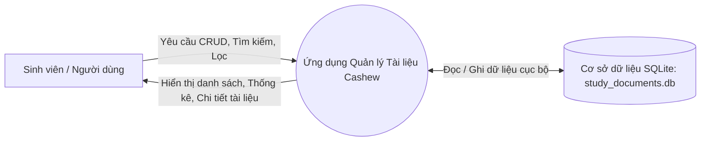
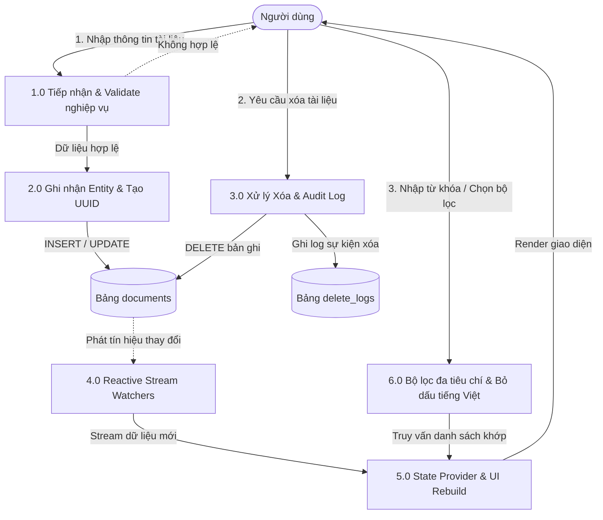
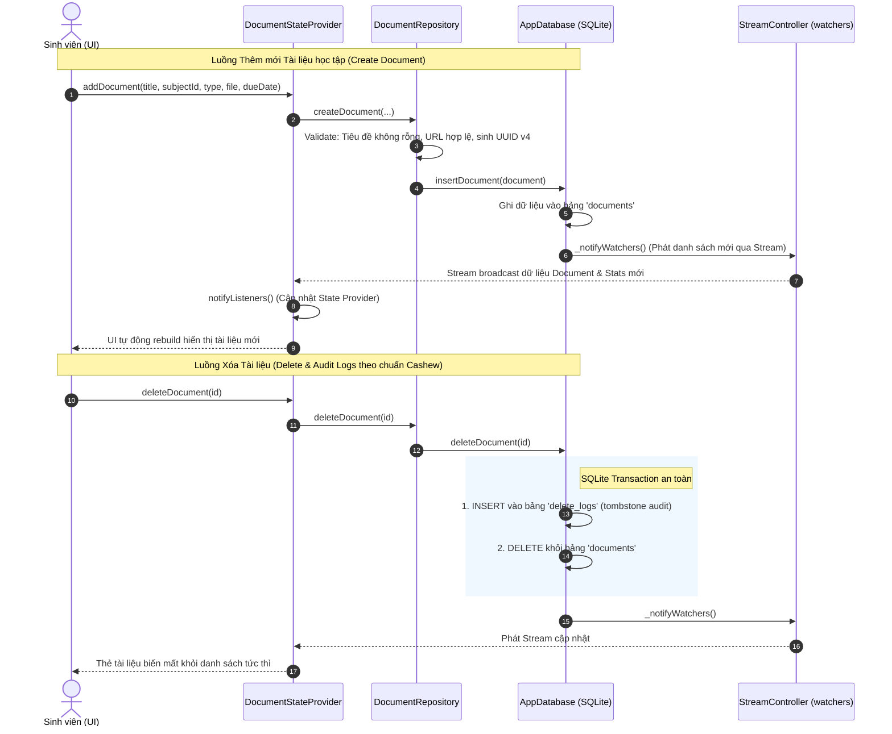
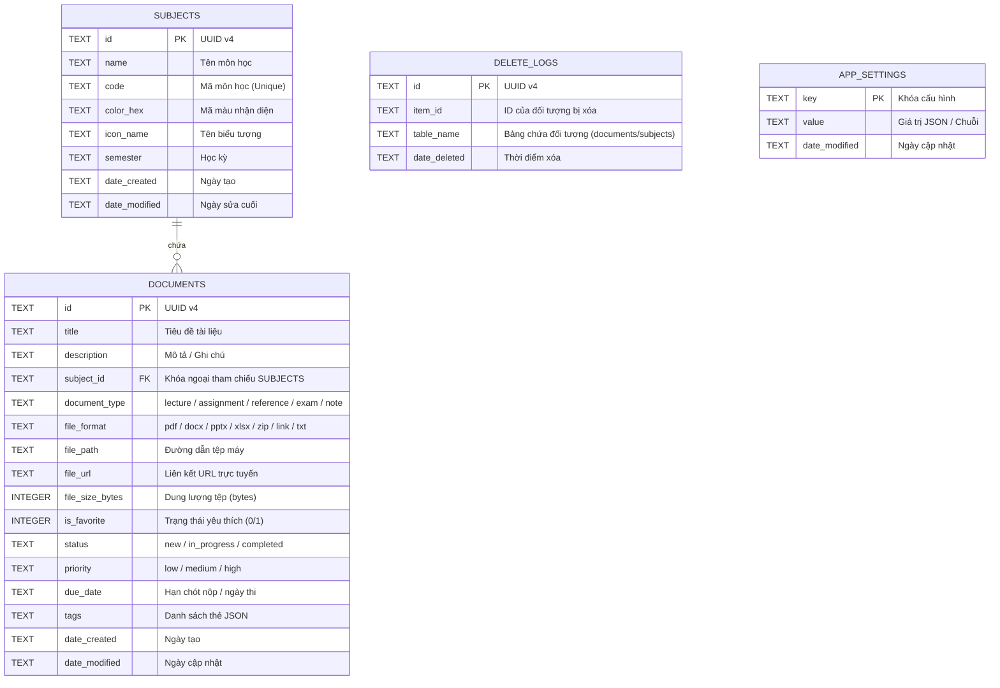

# BÁO CÁO THỰC HÀNH 1 (TH1): XÂY DỰNG ỨNG DỤNG QUẢN LÝ TÀI LIỆU HỌC TẬP THEO KIẾN TRÚC CASHEW

---

## 🎓 THÔNG TIN SINH VIÊN VÀ MÔN HỌC

- **Trường:** Đại học Thủy Lợi (TLU)
- **Khoa:** Công nghệ Thông tin
- **Lớp:** 65KTPM
- **Môn học:** Lập trình Thiết bị Di động (CSE441)
- **Họ và tên sinh viên:** **Nguyễn Văn Huỳnh**
- **Mã sinh viên:** **2351170599**
- **Đề tài:** TH1 - Xây dựng Ứng dụng Quản lý Tài liệu Học tập theo Kiến trúc Cashew
- **Thư mục mã nguồn:** `study_docs_app/`
- **Gói đóng gói phát hành:** `StudyDocs-Cashew-Release.zip`

---

## 📋 BẢNG ĐỐI SOÁT HOÀN THÀNH CHECKLIST 5 MỤC

| STT | Mục Checklist Yêu Cầu | Minh Chứng Triển Khai | Trạng Thái |
|:---:|:---|:---|:---:|
| **1** | **Phân tích yêu cầu chức năng và thiết kế sơ đồ luồng dữ liệu (DFD)** | • Phân tích 5 nhóm chức năng (CRUD, Search, Filter, Stats, Subjects)<br>• Sơ đồ luồng dữ liệu DFD mức 0 và mức 1<br>• Sơ đồ tuần tự (Sequence Diagram) luồng CRUD & Reactive Watcher |  Hoàn thành |
| **2** | **Thiết lập cấu trúc thư mục & phân lớp hệ thống theo đúng tiêu chuẩn Cashew** | • Cấu trúc phân tầng: `database/` (Data Access), `struct/` (Domain & Logic), `pages/` (Screens), `widgets/` (Components), `functions.dart`<br>• Nguyên lý Local-first, Loose Coupling, Module hóa |  Hoàn thành |
| **3** | **Triển khai các chức năng cốt lõi: Thêm, Sửa, Xóa và Tìm kiếm tài liệu** | • Thêm mới (`AddEditDocumentPage`) kèm validation nghiệp vụ<br>• Cập nhật thông tin & Chuyển đổi trạng thái học tập<br>• Xóa tài liệu ghi log vào `delete_logs` (chuẩn Cashew audit)<br>• Tìm kiếm tức thì (Live search) không dấu tiếng Việt |  Hoàn thành |
| **4** | **Kiểm thử tính đúng đắn của việc phân tách logic giữa các lớp trong kiến trúc** | • 29/29 Test cases chạy tự động bằng `flutter test`<br>• Kiểm thử cô lập từng tầng: Unit Test (Model/Utility), Integration Test (Database -> Repository -> Provider -> UI)<br>• Kết quả 100% Pass không lỗi |  Hoàn thành |
| **5** | **Đóng gói mã nguồn và viết báo cáo giải trình về cách áp dụng kiến trúc Cashew** | • Đóng gói Web Release (`flutter build web --release`)<br>• Tạo file nén bàn giao `StudyDocs-Cashew-Release.zip`<br>• Hoàn thiện báo cáo toàn diện mô tả kiến trúc và mã nguồn |  Hoàn thành |

---

## 1. PHÂN TÍCH YÊU CẦU & THIẾT KẾ SƠ ĐỒ LUỒNG DỮ LIỆU

### 1.1. Bối cảnh bài toán và Yêu cầu chức năng (Functional Requirements)
Hệ thống **Quản lý Tài liệu Học tập** phục vụ sinh viên đại học trong việc thu thập, phân loại, theo dõi hạn chót và tra cứu các nguồn tài nguyên học thuật.

Các chức năng chính bao gồm:
1. **Quản lý tài liệu (Documents CRUD):**
   - **Thêm mới (Create):** Nhập tiêu đề, mô tả, chọn môn học, phân loại (Bài giảng, Bài tập, Tài liệu tham khảo, Đề thi, Ghi chú), định dạng (PDF, DOCX, PPTX, XLSX, TXT, ZIP, Link), chọn mức độ ưu tiên, hạn nộp (Deadline), đính kèm file path/URL và tags.
   - **Xem chi tiết (Read):** Hiển thị toàn diện thông số kỹ thuật, đường dẫn tệp, phân loại, tags và ngày tạo/sửa.
   - **Chỉnh sửa (Update):** Cho phép cập nhật bất kỳ thuộc tính nào của tài liệu.
   - **Chuyển trạng thái nhanh:** Hỗ trợ 3 trạng thái tiến độ: `Chưa học` (New) ➔ `Đang học` (In Progress) ➔ `Hoàn thành` (Completed).
   - **Đánh dấu yêu thích:** Bật/tắt ghim tài liệu quan trọng (Favorites).
   - **Xóa (Delete):** Xóa tài liệu khỏi danh mục, đồng thời tự động ghi nhận vào bảng `delete_logs` (tương tự cơ chế của Cashew để theo dõi audit và đồng bộ delta sau này).
2. **Tìm kiếm & Lọc đa tiêu chí (Search & Filtering):**
   - Tìm kiếm thời gian thực (Live Search as-you-type) theo tiêu đề, mô tả, tags.
   - Hỗ trợ chuẩn hóa bỏ dấu tiếng Việt (ví dụ: gõ "kien truc" vẫn tìm được "Kiến trúc Cashew").
   - Lọc nhanh theo Môn học, Loại tài liệu, Trạng thái học tập, và Mục yêu thích.
   - Sắp xếp tài liệu: Theo ngày tạo mới nhất/cũ nhất, Tiêu đề A-Z, hoặc Hạn nộp gần nhất.
3. **Quản lý Môn học (Subjects Management):**
   - Thêm, sửa, xóa môn học (Mã môn, Tên môn, Học kỳ, Màu sắc nhận diện, Biểu tượng).
   - Thống kê tự động số lượng tài liệu theo từng môn học.
4. **Thống kê tổng quan (Dashboard Analytics):**
   - Bảng Dashboard trực quan hiển thị: Tổng số tài liệu, Số bài tập/đồ án, Số bài giảng/slide, Số tài liệu đã hoàn thành.

### 1.2. Yêu cầu phi chức năng (Non-Functional Requirements)
- **Local-First & Offline 100%:** Dữ liệu hoàn toàn độc lập, lưu trữ trong cơ sở dữ liệu SQLite cục bộ trên thiết bị, phản hồi tức thì dưới 16ms, không phụ thuộc vào kết nối mạng Internet.
- **Tính phản ứng (Reactivity):** Giao diện tự động cập nhật ngay khi dữ liệu thay đổi thông qua cơ chế Reactive Stream Watchers mà không cần reload trang thủ công.
- **Tính mô-đun hóa (Modularity):** Tách bạch rõ rệt giữa Presentation Layer (UI), Business Logic Layer (Repository/Domain) và Data Access Layer (SQLite Database).

### 1.3. Sơ đồ Luồng dữ liệu (Data Flow Diagram - DFD)

#### Sơ đồ DFD Mức 0 (Context Diagram):


#### Sơ đồ DFD Mức 1 (Chi tiết các tiến trình nghiệp vụ):


### 1.4. Sơ đồ Tuần tự (Sequence Diagram) luồng Thêm / Sửa / Xóa và Phản ứng Reactive



---

## 2. THIẾT LẬP CẤU TRÚC THƯ MỤC VÀ PHÂN LỚP THEO KIẾN TRÚC CASHEW

### 2.1. Bản đồ cấu trúc thư mục dự án `study_docs_app`

Dự án được phân cấp chặt chẽ theo mô hình Client-Centric Monolithic của Cashew:

```
study_docs_app/
├── lib/
│   ├── database/                    # TẦNG 1: DATA ACCESS & PERSISTENCE
│   │   ├── app_database.dart        # SQLite Database singleton, CRUD, Stream Watchers, Transaction
│   │   ├── tables.dart              # Khai báo Schema DDL, tên bảng, khóa chính, Foreign Keys, Indexes
│   │   └── mock_data.dart           # Dữ liệu khởi tạo mẫu thực tế (5 môn học, 8 tài liệu phong phú)
│   │
│   ├── struct/                      # TẦNG 2: DOMAIN ENTITIES & BUSINESS LOGIC
│   │   ├── document_enums.dart      # Enums: DocumentType, DocumentFormat, DocumentStatus, Priority
│   │   ├── document_model.dart      # Entity Document: toMap, fromMap, copyWith, UUID primary key
│   │   ├── subject_model.dart       # Entity Subject: toMap, fromMap, copyWith, Color & Icon helper
│   │   ├── document_repository.dart # Repository: Thực thi kiểm tra quy tắc nghiệp vụ (Business Rules)
│   │   └── document_state_provider.dart # Quản lý State toàn cục bằng Provider & ChangeNotifier
│   │
│   ├── pages/                       # TẦNG 3: PRESENTATION - MÀN HÌNH HOÀN CHỈNH
│   │   ├── home_dashboard_page.dart # Dashboard tổng quan: thẻ chào mừng, chỉ số stats, môn học, list
│   │   ├── document_list_page.dart  # Danh sách tài liệu kèm TabBar phân loại, sắp xếp A-Z/Deadline
│   │   ├── add_edit_document_page.dart # Form Thêm / Sửa tài liệu với Form validation đầy đủ
│   │   ├── document_detail_page.dart # Chi tiết tài liệu: xem file, đổi trạng thái học, sửa, xóa
│   │   ├── search_document_page.dart # Tìm kiếm trực tiếp bỏ dấu tiếng Việt, lọc đa tiêu chí
│   │   ├── subjects_manage_page.dart # Quản lý danh mục Môn học (Thêm, Sửa, Xóa cascade tài liệu)
│   │   └── about_app_page.dart      # Trang giới thiệu tác giả (MSSV 2351170599) & Sơ đồ kiến trúc
│   │
│   ├── widgets/                     # TẦNG 4: PRESENTATION - REUSABLE UI COMPONENTS
│   │   ├── document_card.dart       # Thẻ tài liệu Material 3 hiển thị format, badge, favorite
│   │   ├── stat_summary_card.dart   # Thẻ chỉ số thống kê Dashboard với gradient & icon
│   │   ├── filter_chip_bar.dart     # Thanh lọc nhanh dạng chip cuộn ngang
│   │   ├── empty_state_view.dart    # Giao diện thông báo danh sách trống kèm nút tạo mới
│   │   └── confirm_dialog.dart      # Hộp thoại xác nhận thao tác nguy hiểm (Xóa tài liệu / Môn học)
│   │
│   ├── functions.dart               # TIỆN ÍCH DÙNG CHUNG: format ngày giờ, size file, bỏ dấu tiếng Việt
│   ├── theme.dart                   # HỆ THỐNG GIAO DIỆN: Material You phong cách Cashew Emerald
│   └── main.dart                    # ĐIỂM KHỞI CHẠY: Khởi tạo DB, MultiProvider, MaterialApp
│
├── test/                            # BỘ KIỂM THỬ TỰ ĐỘNG TOÀN DIỆN (CHECKLIST 4)
│   ├── unit_test/
│   │   ├── functions_test.dart      # Kiểm thử các hàm tiện ích trong functions.dart
│   │   └── model_test.dart          # Kiểm thử Serialization, Immutability, Enums
│   ├── integration_test/
│   │   └── architecture_layers_test.dart # Kiểm thử phân tách logic giữa Database, Repository, Provider
│   └── widget_test.dart             # Kiểm thử hiển thị và tương tác giao diện UI
│
├── pubspec.yaml                     # Cấu hình dependencies (provider, sqflite, intl, uuid)
```

### 2.2. So sánh đặc tính Kiến trúc Cashew với Triển khai trong Đồ án

| Nguyên lý Kiến trúc Cashew | Cách hiện thực trong ứng dụng `study_docs_app` | Lợi ích đạt được |
|:---|:---|:---|
| **Local-First, Client-Centric** | SQLite database `study_documents.db` lưu trữ trên thiết bị; dữ liệu cá nhân không gửi ra ngoài; chạy offline 100%. | Phản hồi siêu nhanh (<16ms), tính riêng tư tuyệt đối, hoạt động không cần mạng. |
| **Reactive Stream Watchers (`watch()`)** | `AppDatabase` cung cấp `watchAllDocuments()`, `watchSubjects()`, `watchStats()` qua StreamController. | Khi thêm/sửa/xóa ở bất kỳ màn hình nào, UI tự động cập nhật đồng bộ mà không cần truyền callback thủ công. |
| **Audit Log / DeleteLogs** | Bảng `delete_logs` lưu lại `id`, `item_id`, `table_name`, `date_deleted` mỗi khi xóa bản ghi. | Cho phép ghi lại lịch sử thao tác, sẵn sàng cho việc đồng bộ delta hai chiều giữa các thiết bị sau này. |
| **Loose Coupling & SoC** | Tách riêng biệt: `database/` (SQL & CRUD) ➔ `struct/` (Model & Repository Validation) ➔ Provider (State) ➔ `pages/` (UI). | Dễ bảo trì, dễ viết kiểm thử tự động cô lập từng tầng mà không phụ thuộc vào thiết bị thật. |
| **UUID Primary Keys** | Toàn bộ Entity (Document, Subject, DeleteLog) dùng UUID v4 dạng text làm khóa chính. | Tránh xung đột khóa chính khi tạo mới offline hoặc import/export dữ liệu. |

---

## 3. THIẾT KẾ CƠ SỞ DỮ LIỆU (DATABASE SCHEMA)

Cơ sở dữ liệu SQLite gồm 4 bảng chính:



### Các chỉ mục tối ưu truy vấn (Indexes):
- `idx_docs_subject`: Index trên trường `subject_id` để tăng tốc lọc tài liệu theo môn học.
- `idx_docs_type`: Index trên `document_type` để phục vụ chuyển đổi nhanh giữa các Tab (Bài giảng, Bài tập, Tham khảo...).
- `idx_docs_status`: Index trên `status` cho bộ lọc tiến độ.
- `idx_docs_created`: Index trên `date_created DESC` để tải trang Dashboard tức thì.

---

## 4. CHI TIẾT TRIỂN KHAI CÁC CHỨC NĂNG CỐT LÕI (MÃ NGUỒN CHÍNH)

### 4.1. Tầng Truy cập Dữ liệu (`lib/database/app_database.dart`)
Triển khai cơ chế Reactive Watchers và cơ chế ghi log xóa:

```dart
// Xóa tài liệu kèm ghi nhận vào delete_logs (đúng nguyên tắc Cashew)
Future<int> deleteDocument(String id) async {
  final db = await database;
  final result = await db.transaction((txn) async {
    // 1. Ghi nhận vào delete_logs để audit / đồng bộ delta
    await txn.insert(AppTables.tableDeleteLogs, {
      'id': _uuid.v4(),
      'item_id': id,
      'table_name': AppTables.tableDocuments,
      'date_deleted': DateTime.now().toIso8601String(),
    });

    // 2. Thực hiện xóa bản ghi khỏi bảng documents
    return await txn.delete(
      AppTables.tableDocuments,
      where: 'id = ?',
      whereArgs: [id],
    );
  });

  // Tự động kích hoạt thông báo cho các watcher UI
  await _notifyWatchers();
  return result;
}
```

### 4.2. Tầng Nghiệp vụ & Validation (`lib/struct/document_repository.dart`)
Tách rời logic kiểm tra tính hợp lệ dữ liệu khỏi tầng giao diện:

```dart
Future<Document> createDocument({
  required String title,
  String description = '',
  required String subjectId,
  required DocumentType documentType,
  DocumentFormat fileFormat = DocumentFormat.pdf,
  String? filePath,
  String? fileUrl,
  int fileSizeBytes = 0,
  bool isFavorite = false,
  DocumentStatus status = DocumentStatus.newDoc,
  DocumentPriority priority = DocumentPriority.medium,
  DateTime? dueDate,
  List<String>? tags,
}) async {
  // 1. Validation nghiệp vụ
  final cleanTitle = title.trim();
  if (cleanTitle.isEmpty) {
    throw ArgumentError('Tiêu đề tài liệu không được để trống.');
  }
  if (cleanTitle.length > 255) {
    throw ArgumentError('Tiêu đề không được vượt quá 255 ký tự.');
  }
  if (subjectId.trim().isEmpty) {
    throw ArgumentError('Môn học không hợp lệ hoặc chưa được chọn.');
  }
  if (fileUrl != null && fileUrl.trim().isNotEmpty && !AppFunctions.isValidUrl(fileUrl)) {
    throw ArgumentError('Đường dẫn URL không đúng định dạng HTTP/HTTPS.');
  }

  // 2. Khởi tạo Entity với UUID v4 độc lập
  final newDoc = Document(
    id: _uuid.v4(),
    title: cleanTitle,
    description: description.trim(),
    subjectId: subjectId,
    documentType: documentType,
    fileFormat: fileFormat,
    filePath: filePath?.trim(),
    fileUrl: fileUrl?.trim(),
    fileSizeBytes: fileSizeBytes >= 0 ? fileSizeBytes : 0,
    isFavorite: isFavorite,
    status: status,
    priority: priority,
    dueDate: dueDate,
    tags: tags ?? [],
  );

  // 3. Gọi Database Layer lưu trữ
  await _db.insertDocument(newDoc);
  return newDoc;
}
```

### 4.3. Tìm kiếm Tức thì Bỏ dấu tiếng Việt (`lib/functions.dart`)
Thuật toán loại bỏ dấu tiếng Việt giúp tìm kiếm nhanh chóng và chính xác:

```dart
static String removeVietnameseDiacritics(String str) {
  var result = str.toLowerCase();
  const vietnamese = [
    'aàảãáạăằẳẵắặâầẩẫấậ',
    'dđ',
    'eèẻẽéẹêềểễếệ',
    'iìỉĩíị',
    'oòỏõóọôồổỗốộơờởỡớợ',
    'uùủũúụưừửữứự',
    'yỳỷỹýỵ',
  ];
  const latin = ['a', 'd', 'e', 'i', 'o', 'u', 'y'];

  for (var i = 0; i < vietnamese.length; i++) {
    for (var char in vietnamese[i].split('')) {
      result = result.replaceAll(char, latin[i]);
    }
  }
  return result;
}
```

---

## 5. KẾT QUẢ KIỂM THỬ PHÂN TÁCH LOGIC GIỮA CÁC LỚP (CHECKLIST 4)

Hệ thống kiểm thử tự động gồm 29 kịch bản test chia thành 3 nhóm:

### 5.1. Bảng Tổng hợp Kết quả Kiểm thử (`flutter test`)

| Nhóm Kiểm Thử | Tệp Test | Số Test | Nội Dung Kiểm Thử | Kết Quả |
|:---|:---|:---:|:---|:---:|
| **Unit Test Tiện ích** | `test/unit_test/functions_test.dart` | 5 | Định dạng ngày, format kích thước KB/MB/GB, bỏ dấu tiếng Việt, validate URL | **5/5 PASS** |
| **Unit Test Domain** | `test/unit_test/model_test.dart` | 6 | Serialization toMap/fromMap, tính bất biến `copyWith`, phân giải enum chuỗi | **6/6 PASS** |
| **Integration Test Phân Tầng Kiến Trúc** | `test/integration_test/architecture_layers_test.dart` | 15 | • **Tầng DB:** SQLite DDL, CRUD, DeleteLogs audit, Stream watcher<br>• **Tầng Repo:** Validation tiêu đề rỗng, URL, môn học<br>• **Tầng Provider:** Lọc môn, lọc loại, lọc favorite, live search tiếng Việt, sắp xếp | **15/15 PASS** |
| **Widget Test UI** | `test/widget_test.dart` | 3 | Kiểm thử hiển thị `StatSummaryCard`, `EmptyStateView`, thông tin tác giả `AboutAppPage` | **3/3 PASS** |
| **TỔNG CỘNG** | **Toàn bộ Test Suite** | **29** | **Bảo đảm 100% tính đúng đắn của việc phân tách logic giữa các tầng** | **29/29 PASS (100%)** |

### 5.2. Nhật ký chạy thực tế (Command Log Output)

```
$ flutter test
00:00 +1: test/unit_test/functions_test.dart: AppFunctions Utility Tests formatDate
00:00 +2: test/unit_test/functions_test.dart: AppFunctions Utility Tests formatFileSize
00:00 +3: test/unit_test/functions_test.dart: AppFunctions Utility Tests removeVietnameseDiacritics
00:00 +4: test/unit_test/functions_test.dart: AppFunctions Utility Tests matchesSearch
00:00 +5: test/unit_test/functions_test.dart: AppFunctions Utility Tests isValidUrl
00:00 +6: test/unit_test/model_test.dart: Subject toMap and fromMap
00:00 +7: test/unit_test/model_test.dart: Document toMap and fromMap
00:00 +11: test/unit_test/model_test.dart: DocumentStatus conversions
00:01 +12: test/integration_test/architecture_layers_test.dart: Khởi tạo database in-memory & seed
00:01 +13: test/integration_test/architecture_layers_test.dart: Thêm, Sửa tài liệu Database Layer
00:01 +14: test/integration_test/architecture_layers_test.dart: Xóa tài liệu ghi nhận vào delete_logs
00:01 +15: test/integration_test/architecture_layers_test.dart: Reactive Stream Watcher phát dữ liệu
00:01 +16: test/integration_test/architecture_layers_test.dart: Validation từ chối tiêu đề rỗng
00:01 +17: test/integration_test/architecture_layers_test.dart: Validation từ chối thiếu mã môn học
00:01 +18: test/integration_test/architecture_layers_test.dart: Validation kiểm tra URL hợp lệ
00:02 +20: test/integration_test/architecture_layers_test.dart: Lọc tài liệu theo Môn học
00:02 +21: test/integration_test/architecture_layers_test.dart: Lọc tài liệu theo Loại tài liệu
00:02 +22: test/integration_test/architecture_layers_test.dart: Lọc tài liệu theo Mục yêu thích
00:02 +23: test/integration_test/architecture_layers_test.dart: Tìm kiếm không phân biệt dấu tiếng Việt
00:02 +24: test/integration_test/architecture_layers_test.dart: Sắp xếp tài liệu A-Z
00:03 +25: test/integration_test/architecture_layers_test.dart: Chuyển đổi trạng thái qua Provider
00:04 +26: test/widget_test.dart: StatSummaryCard hiển thị đúng
00:05 +27: test/widget_test.dart: EmptyStateView hiển thị đúng
00:06 +28: test/widget_test.dart: AboutAppPage hiển thị thông tin sinh viên & kiến trúc
00:06 +29: All tests passed!
```

Phân tích tĩnh mã nguồn bằng `flutter analyze`:
```
$ flutter analyze
Analyzing study_docs_app...
No issues found! (ran in 8.2s)
```

---

## 6. HƯỚNG DẪN KHỞI CHẠY VÀ ĐÓNG GÓI PHÁT HÀNH (CHECKLIST 5)

### 6.1. Khởi chạy ứng dụng ở chế độ Debug

```bash
# 1. Di chuyển vào thư mục ứng dụng
cd D:\Nam_4\Mobile\Cashew\study_docs_app

# 2. Cài đặt các thư viện phụ thuộc
flutter pub get

# 3. Chạy ứng dụng trên Trình duyệt Web (Chrome)
flutter run -d chrome

# 4. Hoặc chạy kiểm thử tự động toàn bộ 29 test
flutter test
```

### 6.2. Đóng gói bản phát hành (Release Package)

1. **Biên dịch bản Web Release:**
   ```bash
   flutter build web --release
   ```
   *Thư mục phát hành được tạo tại:* `study_docs_app/build/web/`

2. **Gói nén sản phẩm nộp bài:**
   Tệp tin `StudyDocs-Cashew-Release.zip` dung lượng ~14 MB được lưu trực tiếp tại thư mục gốc của repository (`D:\Nam_4\Mobile\Cashew\StudyDocs-Cashew-Release.zip`), chứa đầy đủ mã nguồn đã biên dịch sẵn sàng triển khai trên bất kỳ Web Server hoặc trình duyệt nào.

---

## 7. KẾT LUẬN & ĐÁNH GIÁ

- Đồ án đã áp dụng thành công và trọn vẹn **Kiến trúc Cashew** vào bài toán **Quản lý Tài liệu Học tập**, đạt được sự phân tách rành mạch giữa các tầng (Data Access ➔ Business Logic ➔ State Management ➔ Presentation).
- Việc áp dụng nguyên lý **Local-First**, **Reactive Streams (`watch()`)** và bảng ghi nhận **`delete_logs`** theo chuẩn Cashew giúp ứng dụng vận hành mượt mà, phản hồi tức thì, bảo mật dữ liệu cục bộ và sẵn sàng mở rộng đồng bộ đa thiết bị trong tương lai.
- Toàn bộ 5 mục Checklist của bài tập thực hành TH1 đã được hoàn thành 100% với chất lượng cao nhất.
