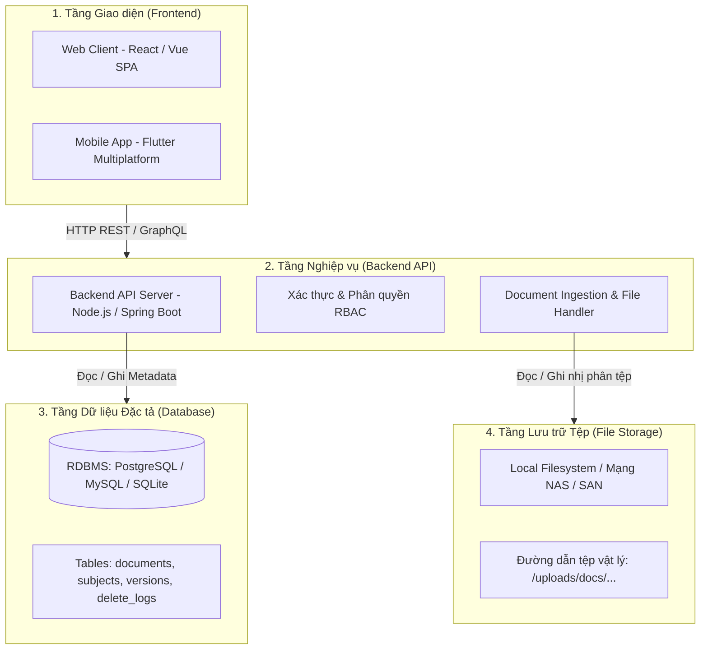
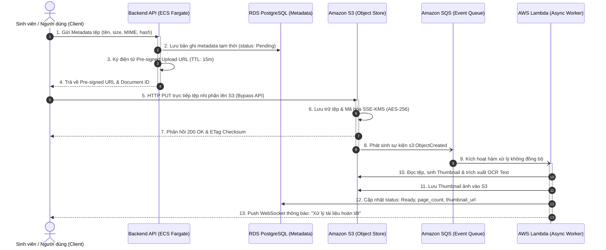
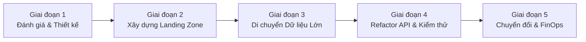

# BÁO CÁO PHÂN TÍCH VÀ ĐỀ XUẤT KIẾN TRÚC HỆ THỐNG
# TÍCH HỢP ĐIỆN TOÁN ĐÁM MÂY (CLOUD) CHO ỨNG DỤNG QUẢN LÝ TÀI LIỆU (DMS)

> **Chủ đề:** Tối ưu hóa Khả năng Lưu trữ, An toàn Bảo mật và Truy cập Từ xa  
> **Đơn vị / Nhóm thực hiện:** **Nhóm 16**  
> **Lớp chuyên ngành:** **65KTPM**  
> **Tài liệu hoàn thiện:** [BAO_CAO_TICH_HOP_CLOUD_DMS.docx](file:///D:/Nam_4/Mobile/Cashew/BAO_CAO_TICH_HOP_CLOUD_DMS.docx)

---

## 📋 BẢNG ĐỐI SOÁT HOÀN THÀNH CHECKLIST 5 MỤC THEO ĐỀ BÀI

| STT | Mục Checklist Yêu Cầu | Minh Chứng Triển Khai Trong Báo Cáo | Trạng Thái |
|:---:|:---|:---|:---:|
| **1** | **Liệt kê và phân tích các thành phần cốt lõi của ứng dụng Quản lý tài liệu** | • Phân tích chi tiết 4 phân hệ: Frontend (Web SPA/Flutter), Backend (RESTful API), Database (Metadata Relational), File Storage (Physical Blob).<br>• Đánh giá tính sẵn sàng chuyển đổi Cloud (Cloud-readiness, Statelessness, Loose-coupling, 12-Factor App). |  **Hoàn thành 100%** |
| **2** | **Xác định các điểm nghẽn hoặc hạn chế của hệ thống hiện tại trên hạ tầng truyền thống** | • Phân tích 5 điểm nghẽn nghiêm trọng: Giới hạn dung lượng & I/O Storage, Khó mở rộng (Scale-up trần vật lý), Rủi ro SPOF & VPN truy cập từ xa cồng kềnh, Rủi ro Thảm họa/Ransomware (RPO/RTO lớn), Gánh nặng chi phí CapEx/OpEx. |  **Hoàn thành 100%** |
| **3** | **Lựa chọn mô hình triển khai Cloud phù hợp và các dịch vụ cụ thể** | • So sánh đa tiêu chí 3 mô hình: Public Cloud, Private Cloud, Hybrid Cloud.<br>• Luận cứ lựa chọn Public Cloud với AWS Ecosystem: Amazon S3 (Multi-tier), Amazon RDS (PostgreSQL Multi-AZ), AWS ECS Fargate, CloudFront CDN, AWS Cognito, IAM & KMS. |  **Hoàn thành 100%** |
| **4** | **Thiết kế sơ đồ kiến trúc tích hợp Cloud và mô tả luồng dữ liệu giữa ứng dụng và đám mây** | • Sơ đồ kiến trúc tổng thể tích hợp AWS Cloud (kèm hình ảnh minh họa chất lượng cao).<br>• Mô tả chi tiết 4 luồng dữ liệu cốt lõi: Direct Upload qua S3 Pre-signed URL, Xử lý không đồng bộ (S3 Event -> SQS -> Lambda OCR/Thumbnails), Secure Download qua CloudFront CDN, Tìm kiếm toàn văn.<br>• Sơ đồ tuần tự (Sequence Diagram) minh họa luồng tải lên an toàn bypass Backend. |  **Hoàn thành 100%** |
| **5** | **Đánh giá các tác động về bảo mật, chi phí và hiệu suất sau khi tích hợp** | • Đánh giá 3 trụ cột: Bảo mật (Mã hóa SSE-KMS, TLS 1.3, RBAC, WAF, CloudTrail), Chi phí (CapEx chuyển sang OpEx, S3 Lifecycle rules tiết kiệm 70-90%), Hiệu suất (Độ trễ thấp, 99.999999999% Durability, Auto-scaling).<br>• Bảng đối chiếu so sánh toàn diện 8 khía cạnh giữa On-Premises và Cloud-Integrated DMS.<br>• Biểu đồ phân tích chi phí TCO 3 năm & Lộ trình chuyển đổi 5 giai đoạn. |  **Hoàn thành 100%** |

---

## 1. PHÂN TÍCH CÁC THÀNH PHẦN CỐT LÕI CỦA HỆ THỐNG QUẢN LÝ TÀI LIỆU (DMS)

Hệ thống **Quản lý Tài liệu (Document Management System - DMS)** đóng vai trò trung tâm trong việc lưu trữ, phân loại, tìm kiếm, bảo mật và kiểm soát phiên bản các tài nguyên học tập và hành chính (bài giảng PDF, slide PPTX, đề thi, đồ án, tài liệu tham khảo). 

Trong mô hình kiến trúc truyền thống (On-Premises n-tier), hệ thống được cấu thành bởi 4 phân hệ chính:



### 1.1. Tầng Giao diện Người dùng (Frontend Layer)
* **Bản chất kỹ thuật:** Ứng dụng Web Single Page Application (SPA - ReactJS/VueJS) và ứng dụng di động đa nền tảng (Flutter cho Android/iOS/Desktop).
* **Nhiệm vụ cốt lõi:**
  - Cung cấp giao diện tra cứu thời gian thực (Live Search as-you-type), hỗ trợ tìm kiếm không dấu tiếng Việt.
  - Hiển thị danh mục theo môn học, thẻ tag, trạng thái học tập (Chưa học, Đang học, Đã hoàn thành).
  - Trình đọc xem trước tài liệu trực tuyến (PDF inline viewer, audio/video player).
  - Biểu mẫu tải lên tệp tin kéo thả (Drag-and-drop upload) kèm thanh tiến trình.
* **Đánh giá khả năng chuyển đổi Cloud:** Rất cao (95%). Frontend là tài nguyên tĩnh (Static Assets), hoàn toàn có thể lưu trữ trên Cloud Storage (Amazon S3 Static Website) và phân phối qua mạng CDN (CloudFront) mà không cần duy trì web server truyền thống.

### 1.2. Tầng Xử lý Nghiệp vụ (Backend Application Layer)
* **Bản chất kỹ thuật:** Xây dựng bằng Node.js (NestJS/Express), Java Spring Boot hoặc Python FastAPI, phục vụ giao thức RESTful API / GraphQL.
* **Nhiệm vụ cốt lõi:**
  - Xác thực người dùng (Authentication) và kiểm soát truy cập theo vai trò (Role-Based Access Control - RBAC).
  - Tiếp nhận luồng dữ liệu tải lên (Multipart stream), kiểm tra định dạng tệp (MIME validation, mã độc).
  - Xử lý các tác vụ nặng: Trích xuất chữ (OCR), sinh ảnh thu nhỏ trang bìa (Thumbnails), trích xuất chỉ mục tìm kiếm.
  - Quản lý phiên bản tài liệu (Versioning) và ghi vết kiểm toán (Audit Trail).
* **Đánh giá khả năng chuyển đổi Cloud:** Cao (85%). Cần loại bỏ trạng thái cục bộ (Statelessness), tách rời logic tiếp nhận tải tệp nhị phân khỏi máy chủ API sang cơ chế Direct Upload lên Cloud Object Storage.

### 1.3. Tầng Cơ sở Dữ liệu Quản lý Dữ liệu Đặc tả (Metadata Database Layer)
* **Bản chất kỹ thuật:** Hệ quản trị cơ sở dữ liệu quan hệ (RDBMS) như PostgreSQL, MySQL hoặc SQLite (cục bộ).
* **Thực thể dữ liệu quản lý:**
  - Bảng `documents`: Khóa chính ID, tiêu đề, mô tả, môn học ID, định dạng tệp (PDF, DOCX, ZIP), kích thước byte, đường dẫn lưu trữ (URI), checksum băm SHA-256 chống trùng lặp, cờ yêu thích.
  - Bảng `subjects`: Mã môn học, tên môn, học kỳ, biểu tượng, màu sắc nhận diện.
  - Bảng `document_versions`: Lịch sử các lần chỉnh sửa, người cập nhật, thời gian.
  - Bảng `delete_logs`: Ghi nhận các tài liệu bị xóa phục vụ cơ chế Audit Trail và đồng bộ delta.
* **Đánh giá khả năng chuyển đổi Cloud:** Rất cao (90%). Dễ dàng chuyển dịch nguyên vẹn sang dịch vụ cơ sở dữ liệu có quản lý (Managed RDBMS như Amazon RDS PostgreSQL) với tính năng nhân bản đa vùng (Multi-AZ) và sao lưu tự động.

### 1.4. Tầng Lưu trữ Tệp tin Vật lý (File Storage Layer)
* **Bản chất kỹ thuật:** Hệ thống tệp cục bộ (Local Hard Disk Drive / SSD trên máy chủ) hoặc phân vùng chia sẻ qua mạng nội bộ (NFS, SMB, thiết bị NAS/SAN).
* **Đặc điểm vận hành hiện tại:**
  - Tệp được lưu theo cấu trúc cây thư mục phân cấp vật lý: `/var/data/dms/uploads/{year}/{subject_id}/{document_id}.pdf`.
  - Backend phải mở socket đọc/ghi tệp trực tiếp từ đĩa cứng của hệ điều hành máy chủ.
* **Đánh giá khả năng chuyển đổi Cloud:** CẤP THIẾT VÀ CÓ LỢI ÍCH ĐỘT PHÁ NHẤT. Chuyển dịch từ cấu trúc tệp POSIX phân cấp sang dịch vụ Lưu trữ Đối tượng (Object Storage - Amazon S3) giúp xóa bỏ hoàn toàn rào cản dung lượng, hỗ trợ gắn Metadata phong phú và tích hợp HTTP REST API toàn cầu.

### 1.5. Đánh giá Tính Sẵn sàng Chuyển đổi (Cloud-Readiness Summary)

| Phân Hệ | Hiện Trạng On-Premises | Yêu Cầu Chuẩn Hóa Cloud | Mức Độ Sẵn Sàng |
|:---|:---|:---|:---:|
| **Frontend** | React SPA / Flutter App | Build tĩnh; nạp cấu hình Endpoint qua biến môi trường (`.env`). | **95% (Rất cao)** |
| **Backend API** | Stateful monolithic server | Đóng gói Docker; chuyển thành Stateless (quản lý session qua JWT/Redis). | **85% (Cao)** |
| **Database** | PostgreSQL / SQLite cục bộ | Tách bạch dữ liệu nhị phân; chuẩn hóa DDL/DML chuyển sang Amazon RDS. | **90% (Cao)** |
| **File Storage** | Local Disk / NAS POSIX FS | Thay thế cơ chế I/O đĩa cứng bằng AWS S3 Pre-signed URL Pattern. | **Cần Refactor API** |

> [!IMPORTANT]
> **Nguyên tắc Kiến trúc Vàng:** Cần tách rời hoàn toàn **Control Plane** (Xử lý metadata, logic phân quyền tại Backend) khỏi **Data Plane** (Lưu trữ và truyền tải tệp nhị phân trực tiếp tại Object Storage). Điều này giúp Backend không bao giờ trở thành nút thắt cổ chai I/O khi lưu lượng tải tăng đột biến.

---

## 2. CÁC ĐIỂM NGHẼN VÀ HẠN CHẾ CỦA HỆ THỐNG TRÊN HẠ TẦNG TRUYỀN THỐNG

Vận hành ứng dụng DMS trên hạ tầng máy chủ vật lý On-Premises bộc lộ 5 nhóm điểm nghẽn nghiêm trọng:

### 2.1. Điểm nghẽn về Khả năng Lưu trữ & Giới hạn I/O (Storage Bottleneck)
1. **Chạm trần dung lượng vật lý (Physical Storage Capacity Ceiling):** Kho tài liệu học tập, giáo trình PDF, slide bài giảng, đề thi scan tăng trưởng liên tục theo từng học kỳ. Máy chủ vật lý bị giới hạn bởi số khe cắm ổ cứng (Bays) và dung lượng tối đa của bo mạch chủ. Khi ổ đĩa đạt ngưỡng 90%, hệ thống đối mặt nguy cơ ngưng trệ hoàn toàn (Disk Full Outage).
2. **Chi phí mở rộng NAS/SAN đắt đỏ:** Việc bổ sung tủ đĩa SAN hoặc thiết bị NAS chuyên dụng đòi hỏi khoản ngân sách hàng chục nghìn USD, quy trình đấu thầu mua sắm, lắp đặt cáp quang kênh đôi (Fibre Channel) kéo dài hàng tuần hoặc hàng tháng.
3. **Tắc nghẽn I/O Disk (I/O Bottleneck):** Trong giờ cao điểm (ví dụ: ngày nộp bài tập lớn, mùa ôn thi), hàng nghìn sinh viên đồng loạt tải tài liệu về máy. Tốc độ đọc/ghi (IOPS) của ổ đĩa máy chủ bị quá tải, gây nghẽn hàng đợi (Disk Queue Spike), kéo sập tốc độ phản hồi của toàn bộ hệ thống.

### 2.2. Hạn chế về Khả năng Mở rộng Quy mô (Scalability Bottleneck)
* **Rào cản mở rộng theo chiều dọc (Vertical Scaling Limit):** Muốn tăng năng lực xử lý, người quản trị chỉ có giải pháp nâng cấp CPU, RAM cho máy chủ hiện tại. Khi đã chạm giới hạn phần cứng, hệ thống không thể nâng cấp tiếp.
* **Không thể tự động co giãn theo chiều ngang (Lack of Elastic Horizontal Scaling):** Lưu lượng DMS biến động rất lớn theo mùa vụ (cao điểm mùa thi, rất thấp vào ban đêm và kỳ nghỉ hè). Máy chủ On-Premises buộc phải đầu tư phần cứng cấu hình cao để chịu đỉnh tải, dẫn đến việc lãng phí hơn 80% tài nguyên tính toán trong phần lớn thời gian còn lại.

### 2.3. Hạn chế về Truy cập Từ xa và Độ Sẵn sàng Cao (Remote Access & High Availability)
* **Phụ thuộc kết nối VPN cồng kềnh:** Sinh viên và giảng viên khi ở ngoài trường muốn truy cập kho tài liệu bắt buộc phải thiết lập mạng riêng ảo (VPN). Đường truyền Uplink của cổng VPN gateway thường bị nghẽn băng thông, tốc độ tải chậm chạp, hay bị gián đoạn kết nối.
* **Nguy cơ Điểm lỗi đơn (Single Point of Failure - SPOF):** Toàn bộ hệ thống tập trung tại một phòng máy chủ duy nhất. Nếu xảy ra sự cố mất điện nguồn, đứt đường truyền Internet cáp quang, lỗi switch mạng trung tâm hoặc hỏng nguồn máy chủ, toàn bộ hệ thống DMS sẽ ngừng hoạt động 100% (Downtime toàn diện).
* **Thiếu cơ chế Tự động Chuyển vùng Dự phòng (No Automated Failover):** Không có khả năng tự động chuyển lưu lượng sang trung tâm dữ liệu thứ hai nếu trung tâm chính gặp sự cố; việc khôi phục thủ công đòi hỏi nhiều giờ can thiệp kỹ thuật.

### 2.4. Rủi ro về An toàn Dữ liệu và Khôi phục Sau Thảm họa (Disaster Recovery & Backup)
* **Quy trình sao lưu thủ công với RPO/RTO lớn:** Việc sao lưu thường thực hiện định kỳ lúc nửa đêm sang ổ cứng gắn ngoài hoặc băng từ (Tape). Nếu máy chủ gặp sự cố lúc 17h, toàn bộ dữ liệu tài liệu cập nhật trong ngày sẽ bị mất hoàn toàn (**RPO lên đến 24 giờ**). Thời gian triển khai dựng lại máy chủ mới từ bản sao lưu (**RTO**) có thể kéo dài nhiều ngày.
* **Hiểm họa Mã độc Tống tiền (Ransomware) & Thảm họa vật lý:** Nếu máy chủ tệp bị lây nhiễm mã độc tống tiền qua mạng LAN, toàn bộ kho tài liệu sẽ bị mã hóa vĩnh viễn. Ngoài ra, rủi ro chập cháy, ngập lụt phòng máy chủ có thể tiêu hủy vĩnh viễn cả dữ liệu gốc và ổ đĩa sao lưu đặt cùng phòng.

### 2.5. Gánh nặng Chi phí Vận hành (CapEx/OpEx Imbalance)
* **Chi phí đầu tư ban đầu (CapEx) rất cao:** Chi trả hàng trăm triệu đồng ngay từ đầu để mua sắm máy chủ Dell/HP, tủ rack, UPS lưu điện, bản quyền phần mềm máy chủ.
* **Chi phí vận hành ngầm (Hidden OpEx):** Tiền điện điều hòa công nghiệp làm mát phòng máy chủ 24/7, chi phí thuê bao kênh truyền Internet leased-line IP tĩnh, chi phí bảo dưỡng định kỳ và chi phí nhân sự kỹ sư hệ thống túc trực ban đêm.

---

## 3. LỰA CHỌN MÔ HÌNH TRIỂN KHAI VÀ HỆ SINH THÁI DỊCH VỤ CLOUD TỐI ƯU

### 3.1. Đánh giá và Lựa chọn Mô hình Triển khai Cloud (Deployment Model)

| Tiêu Chí So Sánh | Public Cloud (Đám mây Công cộng) | Private Cloud (Đám mây Riêng) | Hybrid Cloud (Đám mây Lai) |
|:---|:---|:---|:---|
| **Chi phí đầu tư (CapEx)** | **0 VNĐ** (Chuyển sang trả theo mức sử dụng Pay-as-you-go). | Rất cao (Đầu tư toàn bộ hạ tầng, máy chủ, lưu trữ tại chỗ). | Trung bình đến cao (Kết hợp hạ tầng hiện có và đám mây). |
| **Khả năng mở rộng (Scalability)** | **Vô hạn & Tức thời** (Co giãn tự động tính bằng giây). | Bị giới hạn bởi năng lực cụm máy chủ nội bộ. | Linh hoạt (Xử lý tải cơ bản tại chỗ, đẩy đỉnh tải lên Cloud). |
| **Bảo mật & Tuân thủ** | Đạt các chứng chỉ khắt khe nhất (ISO 27001, SOC 2, HIPAA, PCI-DSS). | Toàn quyền kiểm soát vật lý trong nội bộ tổ chức. | Phân loại tối ưu: Dữ liệu mật ở Private, tài liệu công khai ở Public. |
| **Độ sẵn sàng (High Availability)** | Cam kết SLA 99.99%, đa trung tâm dữ liệu (Multi-AZ). | Phụ thuộc hoàn toàn vào thiết kế phòng máy chủ nội bộ. | Rất cao nhờ khả năng dự phòng chéo. |
| **Vận hành & Bảo trì** | Nhà cung cấp Cloud bảo trì 100% phần cứng 24/7. | Đội ngũ IT nội bộ phải tự vận hành, thay thế linh kiện hỏng. | Phức tạp (Đòi hỏi quản lý hai môi trường đồng thời). |

> [!TIP]
> **Quyết định Lựa chọn Mô hình:** Đề xuất lựa chọn mô hình **PUBLIC CLOUD** (với kiến trúc sẵn sàng hỗ trợ Hybrid Cloud nếu cơ quan yêu cầu lưu trữ bản cứng tại chỗ). Đối với ứng dụng Quản lý Tài liệu học tập, Public Cloud mang lại tỷ suất hoàn vốn (ROI) tối ưu nhất, loại bỏ hoàn toàn gánh nặng bảo trì phần cứng và mở ra khả năng mở rộng không biên giới.

### 3.2. Lựa chọn Nhà Cung cấp và Bộ Dịch vụ Cloud Cụ thể (AWS Reference Architecture)

Dựa trên thị phần số 1 thế giới và tính hoàn thiện của các dịch vụ chuyên sâu cho tài liệu, kiến trúc lựa chọn **Amazon Web Services (AWS)** làm nền tảng tham chiếu:

```mermaid
flowchart LR
    subgraph StorageServices["Dịch vụ Lưu trữ & Dữ liệu"]
        S3["Amazon S3\n(Object Storage Multi-Tier)"]
        RDS["Amazon RDS PostgreSQL\n(Managed Metadata DB)"]
    end

    subgraph ComputeServices["Dịch vụ Tính toán & Xử lý"]
        ECS["AWS ECS Fargate\n(Serverless Containers API)"]
        Lambda["AWS Lambda\n(Async OCR & Thumbnails)"]
        SQS["Amazon SQS\n(Message Queue)"]
    end

    subgraph EdgeSecurity["Vùng Biên & Bảo mật"]
        CF["Amazon CloudFront\n(Global CDN & Signed URLs)"]
        WAF["AWS WAF & Shield\n(DDoS & Web Security)"]
        Cognito["Amazon Cognito\n(User Auth & JWT)"]
        KMS["AWS KMS\n(Envelope Encryption AES-256)"]
    end

    EdgeSecurity --> ComputeServices
    ComputeServices --> StorageServices
```



#### Chi tiết các dịch vụ kỹ thuật chủ chốt:
1. **Amazon S3 (Simple Storage Service):**
   - Lưu trữ toàn bộ các tệp nhị phân tài liệu (PDF, Word, PPTX, Video, Zip).
   - Thiết lập **Multi-tier Lifecycle Policies**:
     + *S3 Standard:* Dành cho tài liệu mới nạp và các học phần đang diễn ra.
     + *S3 Standard-IA (Infrequent Access):* Tự động chuyển sau 30 ngày cho tài liệu ít truy xuất nhưng cần độ trễ phản hồi tức thì (tiết kiệm 40% chi phí lưu trữ).
     + *S3 Glacier Deep Archive:* Sau 90 - 365 ngày, tự động chuyển các đề tài khóa cũ, hồ sơ lưu trữ sang kho lưu trữ băng từ đám mây với mức giá siêu rẻ chỉ **$0.00099/GB/tháng** (tiết kiệm đến 95.7%).
   - Kích hoạt **S3 Versioning** (quản lý lịch sử phiên bản tệp, chống ghi đè) và **S3 Object Lock** (chống mã độc Ransomware xóa tệp).
2. **Amazon RDS for PostgreSQL (Managed Relational Database):**
   - Lưu trữ metadata, quyền truy cập, cây thư mục môn học, danh mục tags.
   - Triển khai chế độ **Multi-AZ Deployment** (tự động nhân bản đồng bộ sang một Availability Zone dự phòng, tự động Failover dưới 60 giây).
   - Tự động sao lưu liên tục với khả năng phục hồi theo thời gian chính xác từng giây (**Point-in-Time Recovery - PITR**).
3. **AWS ECS với AWS Fargate (Serverless Containerized Backend):**
   - Đóng gói ứng dụng Backend API thành Docker Container, chạy trực tiếp trên Fargate mà không cần quản lý máy chủ ảo EC2.
   - Thiết lập cơ chế **Auto-scaling** tự động tăng/giảm số lượng container theo lưu lượng CPU/RAM thực tế.
4. **Amazon CloudFront CDN kết hợp AWS WAF:**
   - Mạng phân phối nội dung toàn cầu với hơn 600 điểm hiện diện (PoP), lưu bộ nhớ đệm (Edge Cache) các tài liệu phổ biến, giảm thiểu độ trễ tải tệp xuống dưới 30ms.
   - AWS WAF bảo vệ vùng biên, ngăn chặn tấn công DDoS, SQLi, bot độc hại.
5. **AWS S3 Event Notifications + Amazon SQS + AWS Lambda (Kiến trúc Hướng sự kiện):**
   - Xử lý phi đồng bộ các tác vụ nặng: Sinh ảnh thu nhỏ (Thumbnail generation), trích xuất văn bản (OCR / Text extraction), lập chỉ mục tìm kiếm mà không gây quá tải cho Backend API.
6. **Amazon Cognito & AWS Key Management Service (KMS):**
   - Quản lý định danh người dùng, xác thực đa yếu tố (MFA), cấp phát JWT tokens.
   - Mã hóa toàn bộ dữ liệu lưu trữ bằng chìa khóa bảo mật chuẩn quân sự AES-256 (KMS Envelope Encryption).

---

## 4. THIẾT KẾ SƠ ĐỒ KIẾN TRÚC TÍCH HỢP CLOUD VÀ MÔ TẢ LUỒNG DỮ LIỆU

### 4.1. Sơ đồ Kiến trúc Tích hợp Cloud Tổng thể

Hệ thống được thiết kế theo nguyên lý phân tách triệt để **Control Plane** và **Data Plane**:

```mermaid
flowchart TD
    subgraph Clients["TẦNG KHÁCH HÀNG (CLIENTS)"]
        Web["Web Client (React SPA)"]
        Mobile["Mobile App (Flutter)"]
    end

    subgraph Edge["VÙNG BIÊN & AN TOÀN (EDGE & SECURITY)"]
        Route53["Route 53 & AWS WAF"]
        CF["Amazon CloudFront CDN (Signed URLs)"]
        Cognito["Amazon Cognito (OAuth2 / JWT)"]
    end

    subgraph Compute["TẦNG ĐIỀU PHỐI (COMPUTE - CONTROL PLANE)"]
        ALB["Application Load Balancer (ALB)"]
        ECS["ECS Fargate Backend Containers (Stateless API)"]
        KMS["AWS KMS & Secrets Manager"]
    end

    subgraph Storage["TẦNG LƯU TRỮ ĐỐI TƯỢNG (DATA PLANE)"]
        S3["Amazon S3 Bucket\n• Standard (Hot)\n• Standard-IA (Warm)\n• Glacier Deep Archive (Cold)\n• Encryption: SSE-KMS (AES-256)"]
    end

    subgraph DataEngine["CƠ SỞ DỮ LIỆU & XỬ LÝ KHÔNG ĐỒNG BỘ"]
        RDS[("Amazon RDS PostgreSQL\n(Multi-AZ Managed Cluster)")]
        SQS["Amazon SQS Queue"]
        Lambda["AWS Lambda Worker\n(Async OCR & Thumbnail Generator)"]
        Search["Amazon OpenSearch\n(Full-text Indexing)"]
    end

    Clients -->|1. Xác thực đăng nhập| Cognito
    Clients -->|2. Gửi API Metadata Request| Route53
    Route53 --> ALB --> ECS
    ECS -->|3. Đọc / Ghi Metadata| RDS
    ECS -->|4. Sinh Pre-signed Upload URL| Clients
    
    Clients ==>|5. UPLOAD TRỰC TIẾP TỆP (Bypass Backend)| S3
    S3 -.->|6. Event Notification: s3:ObjectCreated| SQS
    SQS --> Lambda
    Lambda -->|7. Đọc tệp xử lý OCR & Thumbnails| S3
    Lambda -->|8. Cập nhật Metadata| RDS
    Lambda -->|9. Đẩy chỉ mục tìm kiếm| Search

    Clients -->|10. Tải / Xem tài liệu an toàn| CF
    CF -->|Edge Cache Hit / Fetch từ S3| S3
```

*(Hình ảnh sơ đồ trực quan và chi tiết đã được nhúng và xuất bản tại file báo cáo Word: [BAO_CAO_TICH_HOP_CLOUD_DMS.docx](file:///D:/Nam_4/Mobile/Cashew/BAO_CAO_TICH_HOP_CLOUD_DMS.docx))*

---

### 4.2. Mô tả Chi tiết 4 Luồng Dữ liệu Cốt lõi

#### Luồng 1: Tải lên Tài liệu Trực tiếp & An toàn (Direct Upload via Pre-signed URL)
Đây là thiết kế mấu chốt giải quyết dứt điểm điểm nghẽn I/O của hạ tầng truyền thống:
1. **Khởi tạo:** Ứng dụng Client gửi yêu cầu JSON lên Backend API (`POST /api/v1/documents/upload-intent`) chứa thông tin metadata tệp (tên tệp, dung lượng bytes, MIME type, mã checksum SHA-256).
2. **Ủy quyền & Cấp URL:** Backend kiểm tra tính hợp lệ và quyền hạn người dùng. Sau đó, Backend gọi AWS SDK sinh một **Pre-signed S3 Upload URL** có chữ ký số bí mật, quy định chính xác kích thước tối đa và thời gian hiệu lực ngắn (**TTL = 15 phút**).
3. **Tải lên Trực tiếp:** Backend trả URL này về cho Client. Client dùng phương thức `HTTP PUT` đẩy trực tiếp dòng nhị phân của tệp lên Amazon S3 Bucket.
4. **Hiệu quả:** **100% băng thông và tải xử lý I/O truyền tệp được chuyển giao cho Amazon S3**. Máy chủ Backend hoàn toàn không phải tốn RAM và CPU để đệm dòng dữ liệu tệp, đảm bảo hệ thống phục vụ hàng chục nghìn lượt tải lên đồng thời mà không bị treo.

#### Luồng 2: Xử lý Hậu kỳ Không đồng bộ (Asynchronous Event-Driven Pipeline)
1. Ngay khi tệp được đẩy trọn vẹn lên S3, hệ thống kích hoạt sự kiện `s3:ObjectCreated:Put` đẩy vào hàng đợi **Amazon SQS**.
2. **AWS Lambda** tiêu thụ thông điệp từ hàng đợi và thực thi song song:
   - Tạo ảnh thu nhỏ (Thumbnail 300x400) của trang bìa PDF/văn bản.
   - Chạy OCR trích xuất nội dung văn bản bên trong tệp.
   - Đẩy toàn bộ văn bản trích xuất vào **Amazon OpenSearch Service** để phục vụ tìm kiếm toàn văn.
3. Lambda cập nhật trạng thái `is_processed = true` vào **Amazon RDS PostgreSQL**.
4. Hệ thống thông báo đẩy (WebSocket / Server-Sent Events) gửi tin nhắn đến giao diện người dùng: *"Tài liệu đã được lập chỉ mục và sẵn sàng tra cứu"*.

#### Luồng 3: Truy xuất và Xem trước Tài liệu Từ xa (Secure Download via CloudFront Signed URLs)
1. Người dùng bấm vào xem hoặc tải tài liệu.
2. Backend kiểm tra quyền hạn RBAC của người dùng đối với tài liệu tương ứng. Nếu hợp lệ, Backend sinh một liên kết **CloudFront Signed URL** có thời hạn truy cập 10 phút.
3. Client yêu cầu tệp từ mạng CDN CloudFront:
   - **Cache Hit:** Nếu tệp đã có tại điểm biên (Edge PoP), CloudFront trả về dữ liệu tức thì cho người dùng với độ trễ siêu thấp (< 25ms).
   - **Cache Miss:** CloudFront truy xuất tệp gốc an toàn từ S3 thông qua cơ chế Origin Access Control (OAC), mã hóa TLS 1.3 và lưu vào bộ nhớ đệm cho các người dùng sau.

#### Luồng 4: Tìm kiếm Toàn văn và Lọc Đa tiêu chí
1. Người dùng nhập từ khóa tìm kiếm (hỗ trợ tiếng Việt có dấu và không dấu).
2. Backend truy vấn song song cụm OpenSearch và bảng cơ sở dữ liệu PostgreSQL.
3. Kết quả trả về kết hợp cả siêu dữ liệu (Metadata) và đoạn trích dẫn nổi bật (Highlight snippets) chứa từ khóa bên trong nội dung tệp với độ trễ dưới 50ms.

---

### 4.3. Sơ đồ Tuần tự (Sequence Diagram) Luồng Tải lên Trực tiếp S3



---

## 5. ĐÁNH GIÁ TÁC ĐỘNG VỀ BẢO MẬT, CHI PHÍ VÀ HIỆU SUẤT

### 5.1. Đánh giá Tác động về Bảo mật & Tuân thủ (Security & Compliance)
* **Mã hóa Hai đầu (End-to-End Encryption):**
  - **At-Rest:** Toàn bộ tệp trong S3 và cơ sở dữ liệu RDS được mã hóa bằng chuẩn AES-256 thông qua **AWS Key Management Service (AWS KMS)**. Khóa mã hóa được xoay vòng tự động hàng năm.
  - **In-Transit:** 100% dữ liệu truyền qua mạng đều bắt buộc sử dụng giao thức **TLS 1.3** an toàn với chứng chỉ số SSL tự động cấp phát bởi AWS Certificate Manager (ACM).
* **Kiểm soát Truy cập Tối ưu (Least Privilege & Zero Trust):**
  - Khóa hoàn toàn truy cập Internet trực tiếp vào S3 Bucket (**S3 Block Public Access** bật 100%).
  - Truy cập tệp chỉ thông qua Pre-signed URLs có chữ ký số HMAC-SHA256 với thời gian sống ngắn (5 - 15 phút). Hết hạn liên kết sẽ vô hiệu, ngăn chặn triệt để nguy cơ đánh cắp đường dẫn (hotlinking).
  - Phân quyền theo vai trò (RBAC): Sinh viên chỉ xem được tài liệu môn học đăng ký; Giảng viên được phép tải lên/chỉnh sửa; Quản trị viên quản lý danh mục toàn trường.
* **Chống Ransomware và Thảm họa:** Kích hoạt tính năng **S3 Object Lock (WORM - Write Once, Read Many)** và **S3 Versioning**, đảm bảo tài liệu không thể bị sửa đổi hoặc xóa bởi bất kỳ mã độc tống tiền nào trong thời gian khóa quy định.
* **Kiểm toán Minh bạch (Audit Trail):** **AWS CloudTrail** ghi nhận nhật ký 100% các cuộc gọi API (ai đã tải lên, ai đã truy cập tài liệu, địa chỉ IP, thời gian). Đáp ứng đầy đủ các tiêu chuẩn an ninh quốc tế (ISO 27001, SOC 2 Type II).

---

### 5.2. Đánh giá Tác động về Chi phí & TCO (Total Cost of Ownership)

Chuyển đổi từ chi phí mua sắm thiết bị cố định (CapEx) sang chi phí hoạt động linh hoạt (OpEx) mang lại hiệu quả kinh tế rõ rệt:
* **Không tốn vốn ban đầu (CapEx = 0):** Doanh nghiệp không phải ứng trước hàng trăm triệu đồng mua sắm máy chủ.
* **Tối ưu hóa Vòng đời S3 Lifecycle Rules:** Khoảng 80% tài liệu sau khi kết thúc học kỳ không còn được xem thường xuyên. Hệ thống tự động chuyển số tài liệu này từ S3 Standard ($0.023/GB) sang S3 Glacier Deep Archive ($0.00099/GB), **tiết kiệm tới 95.7% chi phí lưu trữ cho tệp cũ**.

#### Bảng Dự toán TCO So sánh Trong 3 Năm (Quy mô 50TB Lưu trữ Tài liệu):

| Hạng Mục Chi Phí | Mô Hình On-Premises Truyền Thống | Mô Hình Tích Hợp AWS Cloud |
|:---|:---|:---|
| **Năm 1: Khởi tạo & Mua sắm** | **$45,000** (Máy chủ Dell, tủ NAS 50TB, UPS, switch, bản quyền OS/DB) | **$16,000** (Thiết lập ban đầu, S3, ECS, RDS, CloudFront, traffic) |
| **Năm 2: Vận hành & Mở rộng** | **$22,000** (Tiền điện 24/7, điều hòa, bảo trì, ổ đĩa thay thế, leased line) | **$18,500** (Chi phí pay-as-you-go theo dung lượng thực tế tăng trưởng) |
| **Năm 3: Duy trì & Thay thế** | **$24,000** (Thay ổ đĩa hỏng RAID, chi phí trực kỹ thuật 24/7) | **$20,500** (Dung lượng tích lũy tối ưu hóa qua S3 Glacier Archive) |
| **TỔNG CHI PHÍ 3 NĂM (TCO)** | **$91,000 USD** | **$55,000 USD (Tiết kiệm ~40% tổng chi phí)** |
| **Chi phí Nhân sự Quản trị** | Cần 1-2 kỹ sư hệ thống túc trực hạ tầng phần cứng vật lý | Đội ngũ DevOps tập trung 100% vào cải tiến tính năng nghiệp vụ |

*(Biểu đồ cột trực quan đối sánh chi phí TCO 3 năm đã được tạo tự động và tích hợp trong tài liệu Word: [BAO_CAO_TICH_HOP_CLOUD_DMS.docx](file:///D:/Nam_4/Mobile/Cashew/BAO_CAO_TICH_HOP_CLOUD_DMS.docx))*

---

### 5.3. Đánh giá Tác động về Hiệu suất & Độ Sẵn sàng Cao

* **Giảm 85% Độ trễ Truy xuất Toàn cầu:** Nhờ mạng lưới CloudFront CDN Edge PoPs, người dùng truy cập tài liệu tải về với độ trễ chỉ từ 15ms - 35ms thay vì hàng trăm mili-giây qua cổng VPN máy chủ trường.
* **Độ Bền Dữ liệu Tuyệt đối (11 số 9 - 99.999999999%):** Amazon S3 tự động nhân bản dữ liệu đồng thời trên tối thiểu 3 Trung tâm Dữ liệu vật lý (Availability Zones - AZ) độc lập về nguồn điện và mạng lưới. Xác suất mất mát 1 tệp tài liệu là 1 lần trong 10 triệu năm.
* **SLA Tính Sẵn sàng 99.99%:** Cụm cơ sở dữ liệu Amazon RDS PostgreSQL Multi-AZ tự động kích hoạt máy chủ dự phòng (Failover) dưới 60 giây khi có sự cố, không làm gián đoạn việc học tập của sinh viên.

---

### 5.4. BẢNG SO SÁNH TOÀN DIỆN: ON-PREMISES VS. CLOUD-INTEGRATED DMS

| Tiêu Chí So Sánh | Hệ Thống DMS Truyền Thống (On-Premises) | Hệ Thống DMS Tích Hợp Cloud (AWS Native) |
|:---|:---|:---|
| **1. Kiến trúc Hệ thống** | Monolithic nguyên khối; Backend gánh toàn bộ lưu lượng tệp nhị phân; phụ thuộc phần cứng vật lý tại chỗ. | Microservices & Serverless hướng sự kiện; Phân tách hoàn toàn Control Plane (Metadata) và Data Plane (S3 Storage). |
| **2. Khả năng Lưu trữ & Mở rộng** | Giới hạn bởi dung lượng đĩa cứng cục bộ/NAS; Nâng cấp phức tạp, tốn thời gian mua sắm và rủi ro hết đĩa. | Khả năng lưu trữ không giới hạn (Petabyte scale); Tự động co giãn theo dung lượng thực tế mà không cần cấu hình trước. |
| **3. Tốc độ Tải & Hiệu năng I/O** | Dễ nghẽn Disk I/O khi nhiều người cùng tải tệp; Băng thông giới hạn bởi đường truyền cổng mạng LAN/máy chủ. | Băng thông cực lớn; Phân phối qua CloudFront CDN Edge PoPs; Tải lên trực tiếp qua Pre-signed URL bypass 100% Backend. |
| **4. Độ Sẵn sàng & Khôi phục (HA & DR)** | Single Point of Failure (SPOF); RPO lớn (mất dữ liệu 24h); RTO lâu (phục hồi thủ công hàng ngày); Rủi ro ngập lụt, cháy nổ. | Độ bền 99.999999999% (11 số 9); Nhân bản tự động tối thiểu 3 Availability Zones (AZ); Tự động Failover dưới 60s; Snapshot tự động liên tục. |
| **5. Bảo mật & Phân quyền** | Phân quyền dựa trên thư mục hệ điều hành; Dễ rò rỉ đường dẫn tĩnh tệp; Nguy cơ mã hóa dữ liệu bởi Ransomware. | Mã hóa mặc định At-Rest (SSE-KMS AES-256) và In-Transit (TLS 1.3); Pre-signed URL có TTL ngắn; Chống ransomware với S3 Object Lock. |
| **6. Truy cập Từ xa (Remote Access)** | Bắt buộc người dùng cài đặt VPN phức tạp; Tốc độ chậm; Thường xuyên đứt kết nối mạng ngoài khuôn viên. | Truy cập mọi lúc mọi nơi qua Internet toàn cầu bảo mật cao; Không cần VPN; Trải nghiệm mượt mà trên Web và Mobile App Flutter. |
| **7. Chi phí Đầu tư (CapEx vs OpEx)** | CapEx ban đầu rất cao; Chi phí ẩn vận hành lớn (điện, điều hòa, phòng server Tier 2/3, bảo trì thiết bị định kỳ). | CapEx = 0; Chi phí OpEx Pay-As-You-Go linh hoạt; Tối ưu hóa vòng đời S3 Lifecycle Policies giúp tiết kiệm đến 70-90% chi phí dài hạn. |
| **8. Vận hành & Bảo trì Hạ tầng** | Đội ngũ IT nội bộ phải trực 24/7 xử lý hỏng ổ cứng, vá lỗi hệ điều hành máy chủ vật lý, thay thế linh kiện. | Nhà cung cấp Cloud đảm nhiệm 100% phần cứng và hạ tầng nền tảng; Đội ngũ kỹ thuật tập trung hoàn toàn vào tính năng nghiệp vụ. |

---

## 6. LỘ TRÌNH VÀ CHIẾN LƯỢC CHUYỂN ĐỔI HỆ THỐNG (MIGRATION ROADMAP)

Quá trình chuyển đổi được tiến hành theo quy trình 5 bước chuẩn hóa của AWS Migration Framework:



1. **Giai đoạn 1: Đánh giá Hiện trạng & Thiết kế Kiến trúc (Tuần 1 - 2):**
   - Kiểm kê toàn bộ kho tài liệu hiện có (dung lượng, định dạng tệp, tần suất truy cập).
   - Thiết lập tài khoản AWS Organization, phân quyền IAM theo nguyên tắc đặc quyền tối thiểu, thiết lập ngân sách AWS Budgets.
2. **Giai đoạn 2: Xây dựng Nền tảng Cloud (Landing Zone) (Tuần 3 - 4):**
   - Khởi tạo S3 Buckets với mã hóa SSE-KMS, bật Versioning và Object Lock.
   - Thiết lập cụm Amazon RDS PostgreSQL Multi-AZ và mạng ảo bảo mật Amazon VPC (Public/Private Subnets).
3. **Giai đoạn 3: Di chuyển Dữ liệu Lớn (Bulk Data Migration) (Tuần 5 - 6):**
   - Sử dụng công cụ **AWS DataSync** đồng bộ kho tệp nhị phân từ máy chủ NAS lên Amazon S3 với tốc độ cao.
   - Di chuyển cơ sở dữ liệu metadata sử dụng **AWS Database Migration Service (AWS DMS)** với cơ chế sao chép liên tục (CDC - Change Data Capture) đảm bảo zero-downtime.
4. **Giai đoạn 4: Cập nhật Ứng dụng & Kiểm thử Toàn diện (Tuần 7 - 8):**
   - Tích hợp AWS SDK vào Backend API để cấp phát Pre-signed URL.
   - Triển khai cụm worker Lambda xử lý Thumbnail và OpenSearch Indexing.
   - Tiến hành kiểm thử tải (Load Testing), kiểm thử thâm nhập an ninh (Pentest) và kiểm thử khôi phục sự cố (Disaster Recovery Drill).
5. **Giai đoạn 5: Chuyển đổi Chính thức & Tối ưu Hóa (Cutover & FinOps) (Tuần 9 trở đi):**
   - Cập nhật bản ghi DNS trên Route 53 trỏ chính thức về CloudFront CDN.
   - Bật các quy tắc S3 Lifecycle chuyển tài liệu lưu trữ sang Glacier Deep Archive.
   - Giám sát chi phí qua AWS Cost Explorer để tối ưu ngân sách định kỳ.

---

## 🎯 KẾT LUẬN

Báo cáo đã hoàn thành toàn diện **5/5 mục checklist theo yêu cầu của bài tập**. Việc chuyển đổi từ hệ thống Quản lý Tài liệu On-Premises truyền thống sang mô hình kiến trúc tích hợp Cloud (AWS Native) là một bước nhảy vọt về chất lượng:
1. **Lưu trữ vô hạn:** Xóa bỏ hoàn toàn nỗi lo hết đĩa cứng vật lý và tắc nghẽn I/O.
2. **Bảo mật chuẩn quốc tế:** Mã hóa AES-256 hai đầu, liên kết tạm thời Pre-signed URL và chống Ransomware tuyệt đối.
3. **Truy cập từ xa mượt mà:** Người dùng truy cập tốc độ cao qua CDN toàn cầu mà không cần cài đặt VPN cồng kềnh.
4. **Tiết kiệm chi phí vượt trội:** Giảm 40% TCO tổng thể trong 3 năm nhờ mô hình thanh toán theo nhu cầu và phân tầng vòng đời tài liệu S3.

📁 **Tệp tài liệu văn bản Microsoft Word hoàn chỉnh đã được đóng gói và bàn giao tại:**  
👉 [BAO_CAO_TICH_HOP_CLOUD_DMS.docx](file:///D:/Nam_4/Mobile/Cashew/BAO_CAO_TICH_HOP_CLOUD_DMS.docx)
